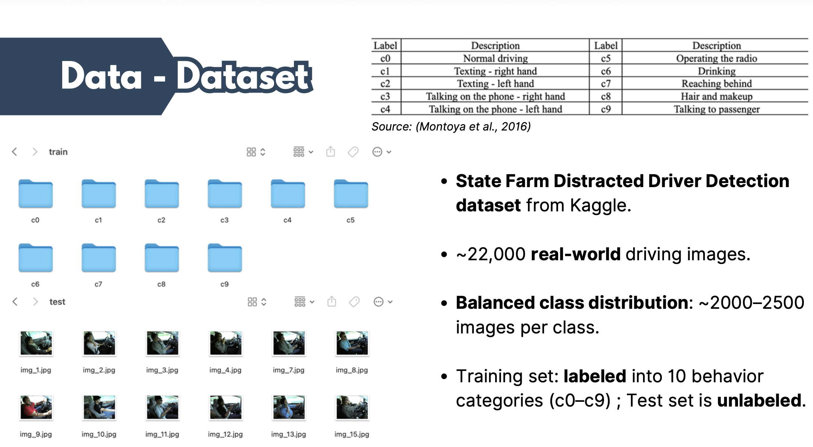
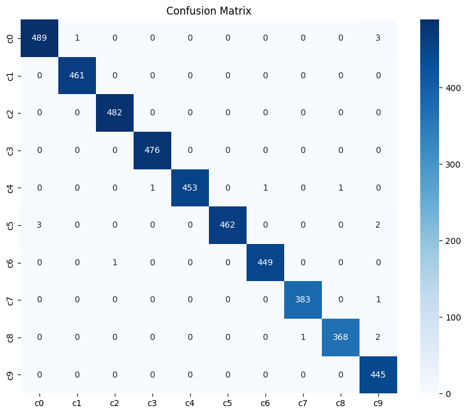
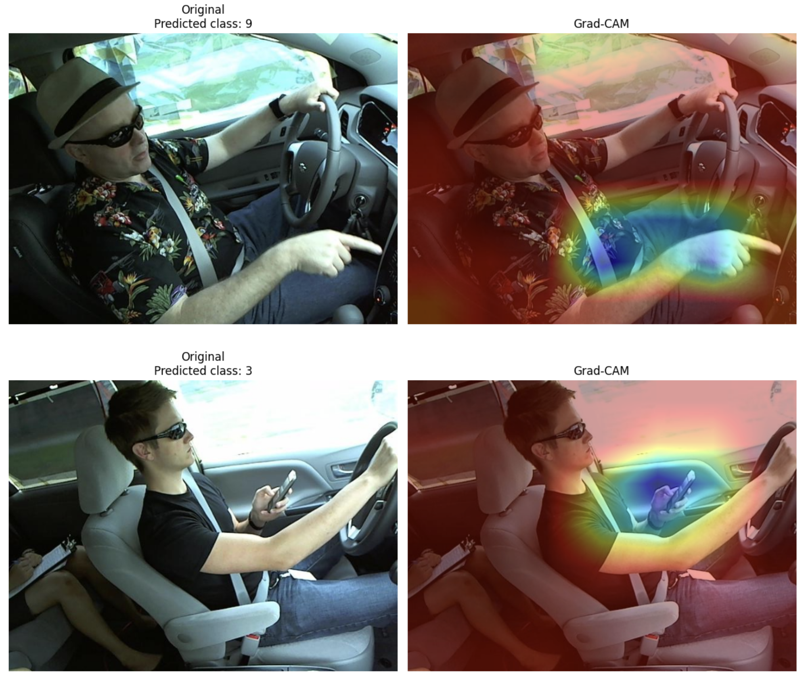
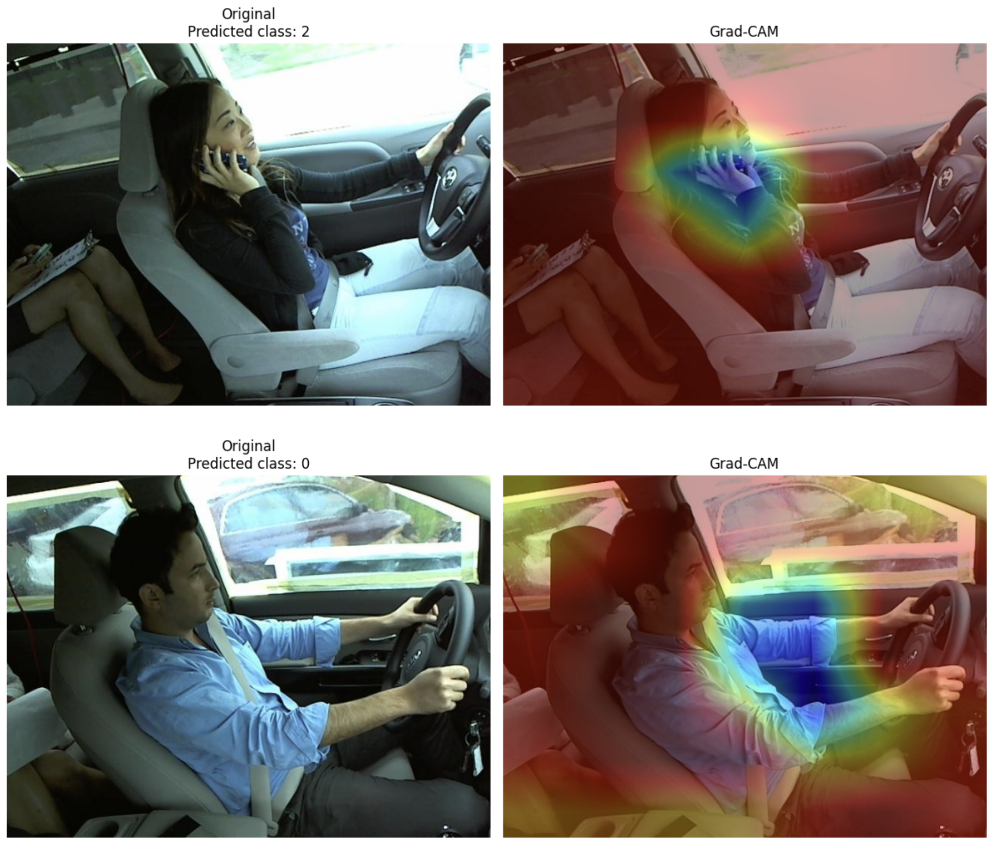
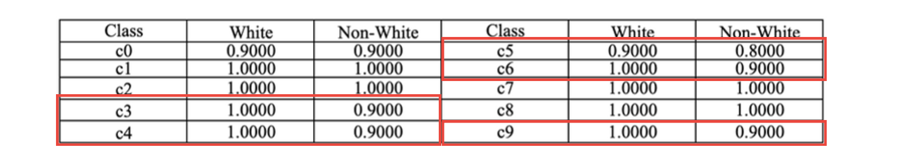

# Responsible AI Distracted Driving Audit

This project examines distracted driving detection through a Responsible AI lens.

Rather than focusing only on classification accuracy, it uses a fine-tuned VGG16 model and Grad-CAM to ask a more important question for safety-critical AI systems: **does the model attend to semantically relevant cues, and do its attention patterns shift across visual subgroups in ways that may indicate shortcut learning or bias?**

## Why This Project Matters

Distracted driving remains a major public safety problem, and computer vision models are increasingly proposed as a way to monitor driver behavior automatically. However, strong predictive performance alone is not enough in real-world settings. In a safety-critical application, it is also important to understand:

- what visual cues the model is using
- whether those cues are behaviorally meaningful
- whether attention patterns differ across subgroups in concerning ways

This project treats Grad-CAM not just as a visualization tool, but as an auditing tool for interpretability and potential attention bias.

## Project Goals

This project was designed to:

- fine-tune a VGG16 model for 10-class distracted driving classification
- evaluate performance using validation metrics and confusion matrices
- generate Grad-CAM heatmaps for model interpretability
- compare attention behavior across manually constructed White and Non-White driver subsets
- examine whether model focus remains relevant or shifts toward potentially spurious visual features

## Dataset

The project uses the **State Farm Distracted Driver Detection** dataset from Kaggle.

- around 22,000 real-world driver images
- 10 labeled behavior classes (`c0` to `c9`)
- training set organized by class folders
- unlabeled test set for unseen images

To support a fairness-oriented audit, I also created smaller manually selected subgroup sets for each driving behavior category:

- White drivers
- Non-White drivers

These subsets were used to compare Grad-CAM attention patterns under more controlled visual conditions.

## Methods and Workflow

### 1. Data Preparation
- loaded training images using folder-based labels
- applied standard image transforms and normalization
- created a custom test dataset class for unlabeled test images

### 2. Model Training
- fine-tuned a pretrained **VGG16** model
- replaced the final classification layer for 10-class output
- trained using SGD with learning rate `0.001` and momentum `0.9`
- optimized with cross-entropy loss

### 3. Performance Evaluation
- evaluated model behavior on a validation split
- generated classification reports
- visualized confusion matrices to identify class-level weaknesses and confusions

### 4. Interpretability and Fairness Audit
- used Grad-CAM on the last convolutional layer
- visualized model attention heatmaps
- compared attention focus across subgroup examples
- interpreted whether the model focused on relevant cues such as hands, face regions, or driving-related objects, versus irrelevant background or clothing features

## Example Outputs

### Dataset overview


This figure summarizes the State Farm distracted driving dataset and the subgroup setup used for the interpretability and fairness-oriented audit.

### Validation confusion matrix


The confusion matrix helps reveal which distracted driving behaviors are easier or harder for the model to distinguish, including confusion between visually similar actions.

### Grad-CAM examples: White subgroup


These examples illustrate how the model attends to salient visual regions for one subgroup during distracted driving classification.

### Grad-CAM examples: Non-White subgroup


These examples are used to compare whether the model maintains semantically relevant focus or shifts toward less relevant cues across subgroup images.

### Fairness audit summary


This summary figure captures the main interpretability concern explored in the project: even when overall classification appears reasonable, model attention may differ across visual subgroups in ways that deserve closer ethical and technical scrutiny.

## Key Findings

- A pretrained VGG16 model can achieve strong distracted driving classification performance, but accuracy alone does not explain how decisions are made.
- Grad-CAM helps reveal whether the model is focusing on behaviorally meaningful image regions.
- In subgroup-based qualitative auditing, some attention maps suggest more relevant focus for one subgroup and more irrelevant or spurious focus for another.
- These findings are not sufficient to claim definitive demographic bias, but they do support the need for interpretability-based auditing in safety-critical computer vision systems.

## Repository Structure

```text
responsible-ai-distracted-driving-audit/
├── README.md
├── .gitignore
├── LICENSE
├── requirements.txt
├── notebooks/
│   └── distracted_driving_audit.ipynb
├── src/
│   ├── data_loader.py
│   ├── train_vgg16.py
│   ├── evaluate_model.py
│   └── gradcam_analysis.py
├── assets/
│   ├── dataset_overview.png
│   ├── confusion_matrix.png
│   ├── gradcam_white_examples.png
│   ├── gradcam_nonwhite_examples.png
│   └── fairness_audit_summary.png
├── data/
│   └── README.md
```

## Data Note

The full image dataset is not stored in this repository due to size constraints. See `data/README.md` for the expected dataset source and folder structure.

